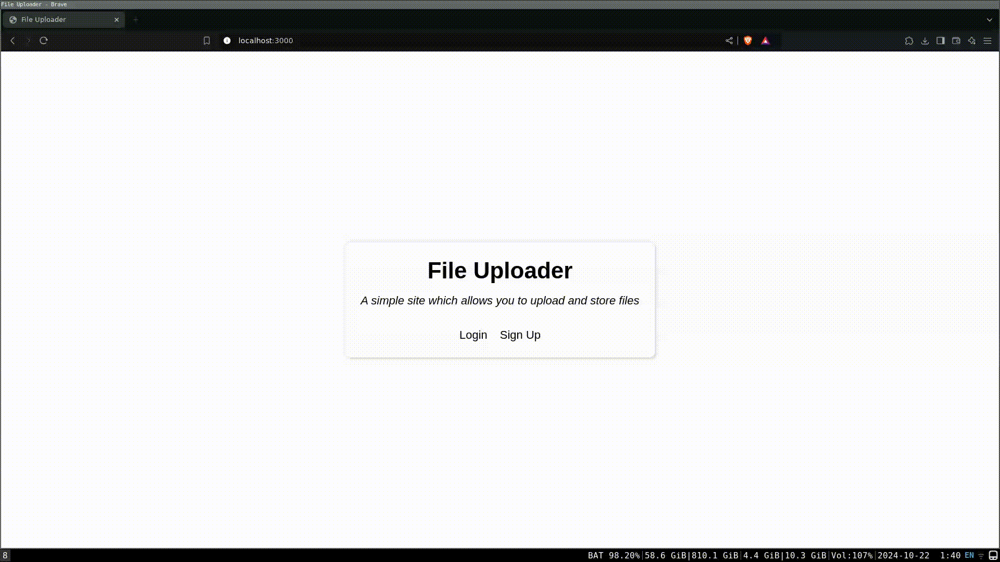

# File Uploader

A simple web app that is similar to Google Drive that allows users to upload and store files, create folders, and redownload files or folders at a later time.

This project helped me learn more about Prisma, a popoular ORM in Javascript. The tech stack also includes Node.js, Express, PostgreSQL, EJS, Passport.js, and Typescript.

The site is not deployed anywhere. However, you can find a demo of the project below.

